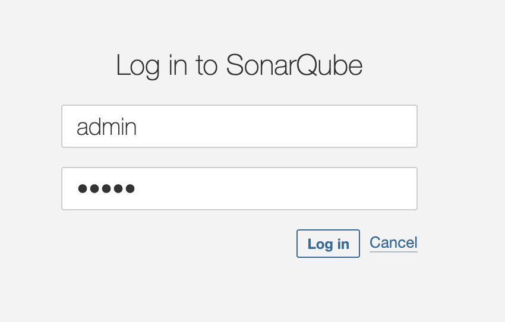
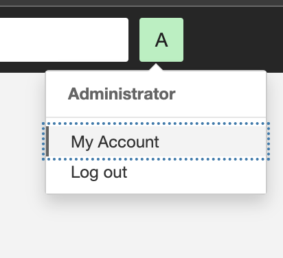
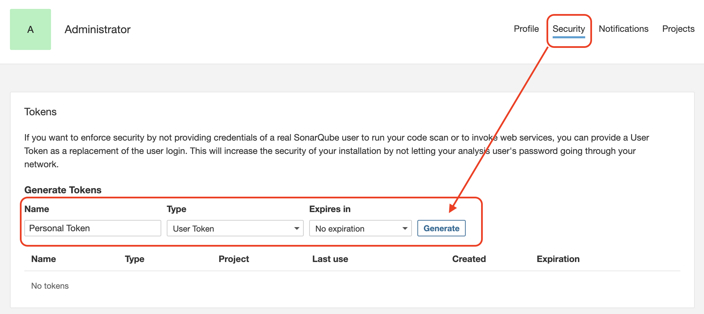
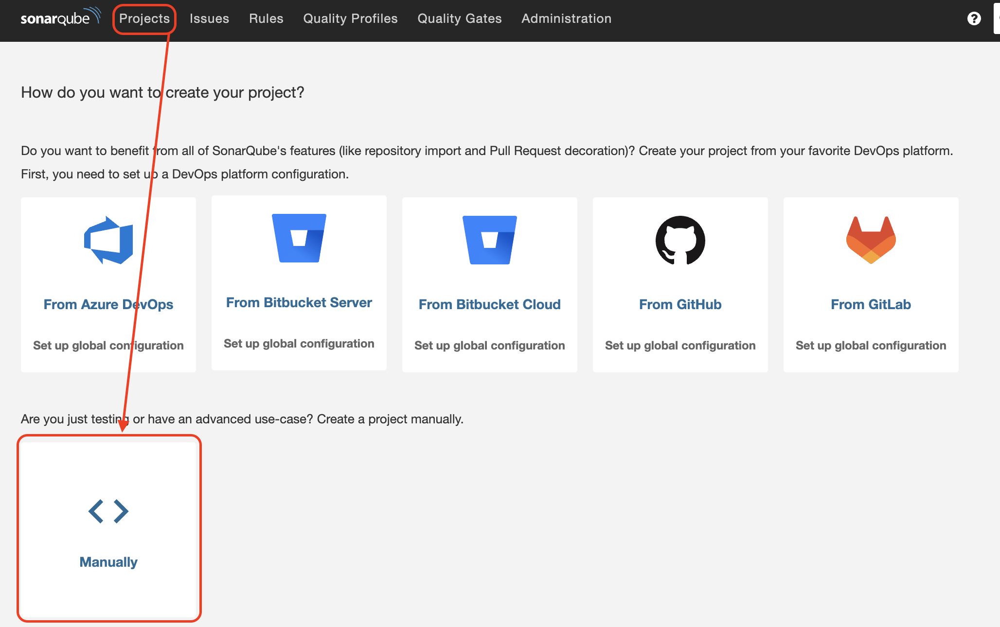
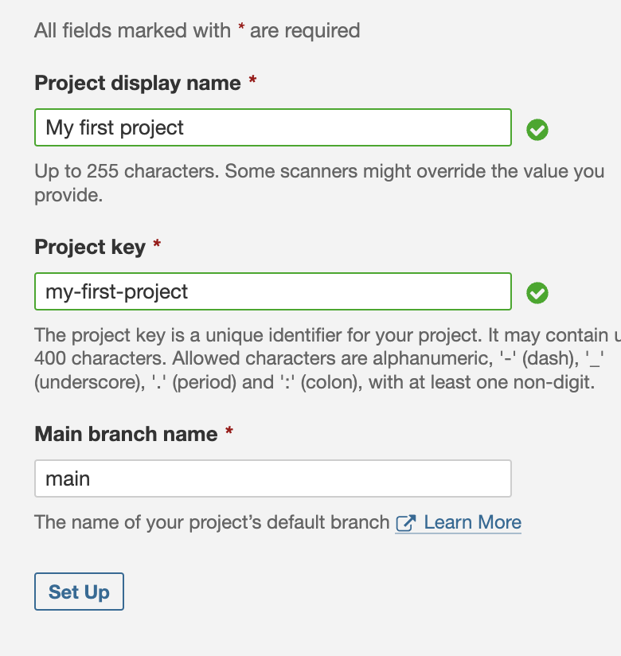

# SonarQube instance

This Docker instance will start a SonarQube instance. It will allow you to
measure the quality of your application.

If you really want to remove the instance with all persisted data,
then you must run the following command inside this folder:

```bash
docker compose down --volumes
```

## How to use it

In order to use it you have to follow the next steps:

1. Start the SonarQube instance using `docker compose up -d sonarqube`.
1. Access to [http://localhost:9000](http://localhost:9000) and enter using
   the `admin/admin` credentials (it would take a while)

   

   1. You will be prompted to change your password for the first time.

1. Create your personal SonarQube token to use CLI access.

   
   

1. Create a copy of the [.env.example](./.env.example) called `.env` in the
   root folder.
1. Copy your token and paste it in the `SONAR_LOGIN` key in `.env` file
   1. Change the `PATH_TO_REPOSITORY` key in there to point to your project
      (prefer absolute paths).
1. Create a project in SonarQube

   

   1. Set the name of your project (it will be changed after, when analysing the
      project) and set a **Project key** that needs to be unique.

   

1. Create a copy of the [sonar-scanner.properties.example](./sonar-scanner.properties.example)
   called `sonar-scanner.properties` in the root folder.
1. Copy the **Project key** in the `sonar-scanner.properties` file, under the
   `sonar.projectKey` attribute.
   1. Configure the rest of the properties in there.
1. Run `docker compose up scanner` and wait until it's done (it take a while).
1. When the process it's done, SonarQube will automatically reload the page
   to show you the results.
