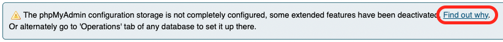

# MariaDB instance

This Docker compose will create a MariaDB instance that will persist
data inside a volume called `mariadb_data`, meaning that every time
this instance is removed, all the data will be saved and recovered
if the instance is created again.

If you actually want to remove the instance with all persisted data,
then you must run the following command inside this folder:

```bash
docker compose down --volumes
```

## UI

You can go to [http://localhost:8091](http://localhost:8091) and use
the provided interface to query and manage your databases.

When you access to the UI, you will see some warning messages related with
the configuration. To resolve it follow these steps:

- Click `Find out why`.

  

- Click `Create` and setup (automatically) required database.

  
