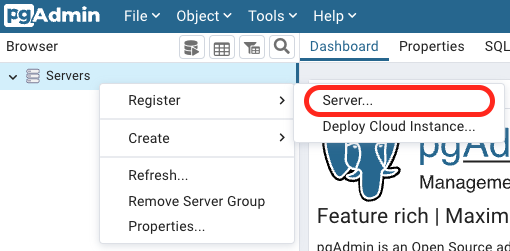
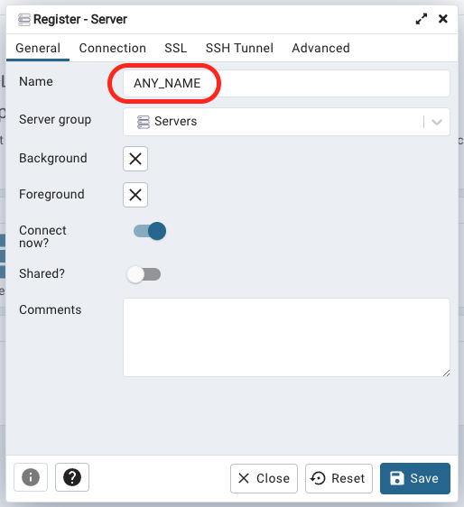
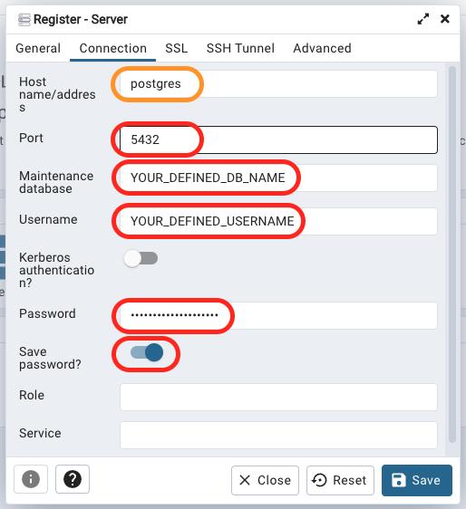

# PostgreSQL instance

This Docker compose will create a PostgreSQL instance that will persist
data inside a volume called `postgres_data` and `postgres_pgadmin-data`,
meaning that every time this instance is removed, all the data will be
saved and recovered if the instance is created again.

If you actually want to remove the instance with all persisted data,
then you must run the following command inside this folder:

```bash
docker compose down --volumes
```

## UI

You can go to [http://localhost:5050](http://localhost:5050) and use
the provided interface to query and manage your databases.

In order to connect your PostgreSQL instance to pgAdmin, you have to
follow these steps:

- Access [pgAdmin](http://localhost:5050) using credentials
  defined in your `.env` file.

- Register a new server.

  

- Set server name.

  

- Set credentials.

  

  **IMPORTANT:** The `Host name/address` variable, marked as **orange**, must be
  set equals to the Docker's container name, else connection will be unstable
  when you restart the server. Also, _localhost_ will not be your host address
  when using the container, meaning it will not work as expected.

  **TIP**: Remember to mark `Save password?` switch in order to remember your credentials.
