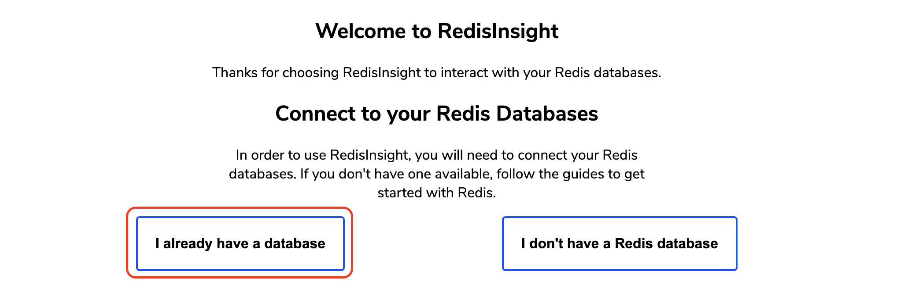
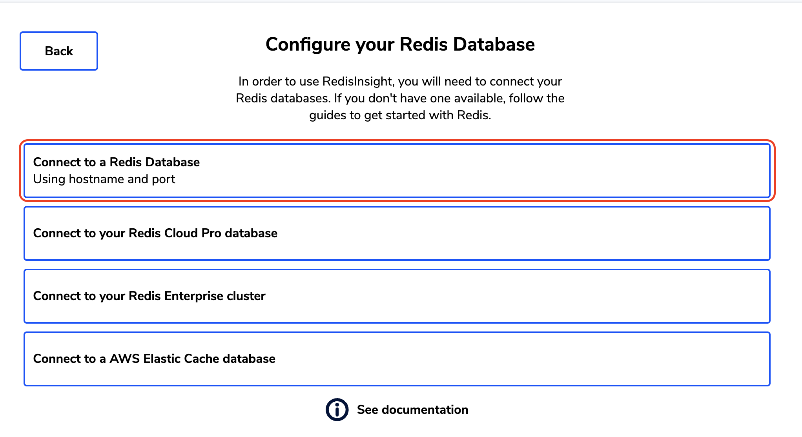
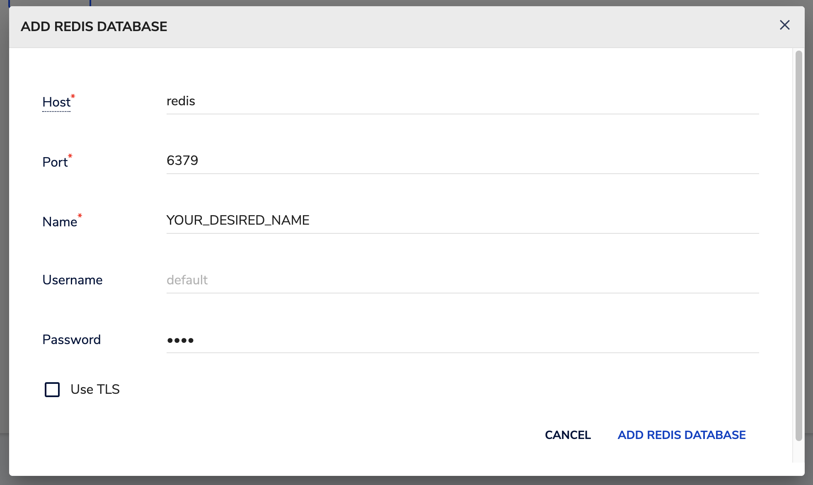

# Redis instance

This Docker compose will create a Redis instance that will persist
data inside a volume called `redis_data` and `redis_redisinsight_data`,
meaning that every time this instance is removed, all the data will be
saved and recovered if the instance is created again.

If you actually want to remove the instance with all persisted data,
then you must run the following command inside this folder:

```bash
docker compose down --volumes
```

## UI

You can go to [http://localhost:5540](http://localhost:5540) and use
the provided interface to query and manage your databases.

In order to connect your Redis instance to RedisInsight, you have to
follow these steps:

- Access to [RedisInsight](http://localhost:5540).

- Select _"I already have a database"_.

  

- Select _"Connect to a Redis Database"_.

  

- Set Redis connection parameters.

  

  **IMPORTANT:** The `Host` variable must be set equals to the Docker's container
  name, else connection will be unstable when you restart the server. Also,
  _localhost_ will not be your host address when using the container, meaning that
  will not work as expected.

  **IMPORTANT:** The `Username` variable must be the default, except if you already
  create a username and password (not the default usage).

  **IMPORTANT:** The `Password` variable must be the password defined under `REDIS_AUTH`
  in your `.env` file.
